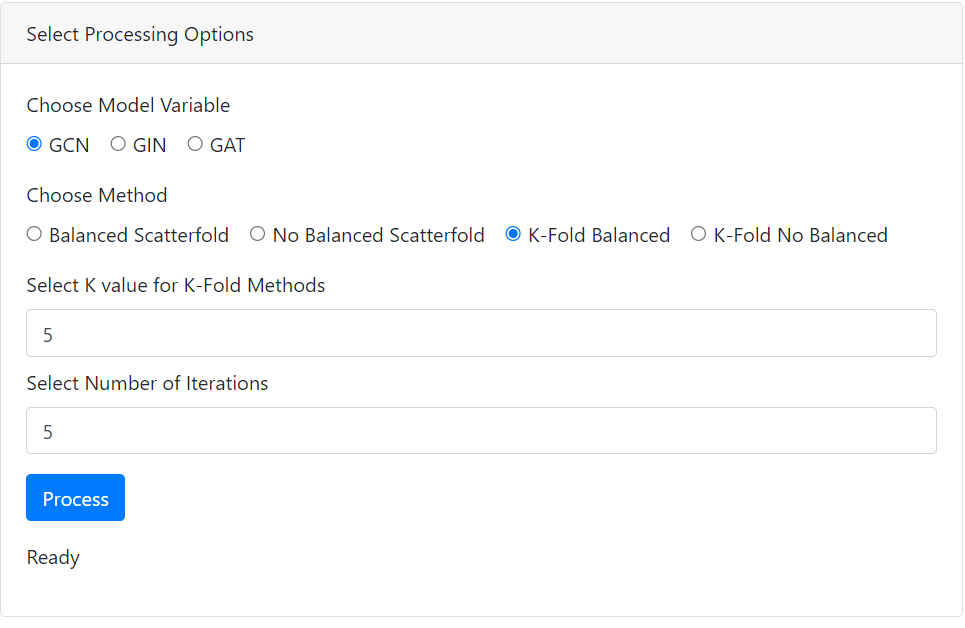
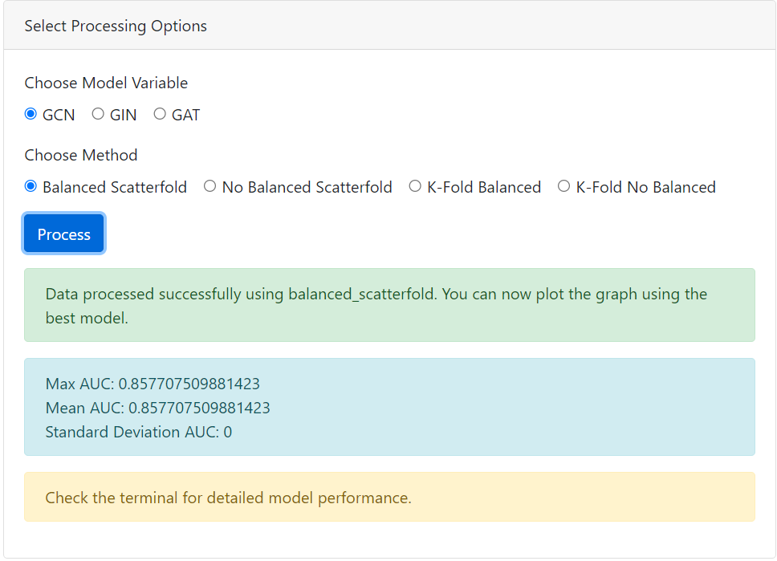

# Navigating the *explainable* Molecular Graph:
## Best Practices for Representation Learning in Bioinformatics


The goal of this project is to provide preliminary guidelines on using *Graph Representation Learning* techniques in *Molecular Property Prediction*.
Specifically, the repository is organized in two sections:
 
1. **Experiments:** files and source code produced during experiments carried out to compare *Graph Embedding Methods* and *GNNs* on established benchmarking datasets in **SMILES** format (*HIV*, *BBBP*, *BACE*, *CLINTOX*).
2. **Platform:** source code of a platform developed for molecular property prediction experiments, allowing users to upload SMILES format datasets and test various embedded GNN models; the platform incorporates the *gradient attribution map* technique as attention mechanisms, which adapts gradients from GNNs to identify critical atoms influencing classification outcomes; by highlighting these key components, the platform enhances interpretability, providing detailed insights into molecular structures and properties.


## Experiments
 Experiments conducted to evaluate various GNNs and graph embedding methods for molecular classification tasks by leveraging well-known benchmarking datasets in **SMILES** format, i.e., *HIV*, *BBBP*, *BACE*, *CLINTOX*. Extensively used in the literature to benchmark models for molecular property prediction and drug discovery tasks. We systematically tested and compared various GNN architectures and traditional graph embedding techniques. For each dataset, we evaluated their performance to identify strengths and limitations in predicting molecular properties. 
 We trained several different GNNs to assess their performance on the aforementioned datasets: *Graph Convolutional Network* (**GCN**), *Graph Isomorphism Network* (**GIN**), and *Graph Attention Network* (**GAT**). As for the graph embedding methods, also in this case we provide details about the models that achieved the best performance, i.e, a *Fully Connected Neural Network* using three well-known graph embedding techniques as input: **Node2Vec**, **SDNE**, and **HOPE**.

In the experiment folder, is possible to find the notebook file **Experiment Notebook**, the initial cells in this notebook are designed to install common dependencies and execute shared functions necessary for conducting experiments on various datasets using the **Node2Vec**, **SDNE**, and **HOPE** techniques.
Each technique has its own set of cells dedicated to creating the embedding dataset using the chosen method. These cells also handle the training and testing of a fully connected network to evaluate performance.

## Platform
To use the dedicated platform, the following requirements must be satisfied:
- Python 3.x
- Flask
- Werkzeug
- Pandas
- Torch
- Torch-Geometric
- Scikit-learn
- Numpy
- Matplotlib
- NetworkX
- RDKit
- Pyngrok (for Colab)

## Installation
The platform is easy and ready to use, after the dependencies are satisfied, the **PlatformAPP.ipynb** is ready to use.

The functionalities are:
- Upload a SMILES dataset for processing.
  
  
This section gives the possibility to download any SMILES dataset.
For a correct usage, the dataset has to satisfied the following requirements: a column named *SMILES* and a column named *target* in order to recognize the input data to transform a *SMILES* string in a *Molecule Graph*.

 This section of the platform gives the possibilty to choose one of the pre-integrated GNN model to classify the processed SMILES Dataset.
 The user can:
- Select between different machine learning models: **GCN**, **GIN**, and **GAT**.
- Choose between different methods: *Balanced Scatterfold*, *No Balanced Scatterfold*, *K-Fold Balanced*, and *K-Fold No Balanced*.
  
  
  Once the model and training methodology are selected, the platform displays the performance metrics for both the training and test phases:
   

   
  - Visualize the Molecule Importance from a *SMILES String*
    After the training of the model, is possible to visualize the importance of each atom in a molecule giving in input a SMILES string of the input dataset into the dedicated form.
    

    The color intensity of the atom highlights indicates their importance in the model's classification process. The stronger the color, the more that part of the molecule influences the classification    


### Google Colab Setup

1. Open Google Colab and create and import the SARflaskAPP folder.

2. Open SARFlaskAPP.ipynb


3. Obtain your Ngrok authtoken from [Ngrok](https://dashboard.ngrok.com/get-started/your-authtoken) and run:
    ```python
    !ngrok authtoken YOUR_NGROK_AUTH_TOKEN
    ```

4. Execute the Colab cells!

7. The output will contain an Ngrok public URL. Open the URL in your web browser to access the application.

### Local Setup

1. Clone the repository:
    ```sh
    git clone https://github.com/yourusername/smiles-dataset-processor.git
    cd smiles-dataset-processor
    ```

2. Install the required Python packages:
    ```sh
    pip install flask werkzeug pandas torch torch-geometric scikit-learn numpy matplotlib networkx rdkit pyngrok
    ```

3. Add the path to your local scripts in the `app.py` file:
    ```python
    sys.path.append('/path/to/your/local/scriptSAR')
    ```

4. Add path to the template folder

4. Run the Flask application:
    ```sh
    python app.py
    ```

5. Open your web browser and go to `http://127.0.0.1:5000`.


## Usage

1. **Upload a SMILES Dataset**: Select and upload your SMILES dataset file.

2. **Select Processing Options**:
   - Choose a model (GCN, GIN, GAT).
   - Choose a method (Balanced Scatterfold, No Balanced Scatterfold, K-Fold Balanced, K-Fold No Balanced).
   - If K-Fold is selected, specify the number of iterations and k-fold value.

3. **Process the Data**: Click the "Process" button to start training. Check the terminal for performance details.

4. **Plot the Graph**: After processing, specify the data index and click "Plot" to visualize the feature importance.

## Notes

- Ensure that the paths to the script and template folders are correctly set based on your environment (local or Colab).
- When running on Colab, you need to provide your Ngrok authtoken to create a public URL for the Flask app.

## Contributing

Feel free to fork this repository and make changes. Pull requests are welcome!

## License

This project is licensed under the MIT License.

